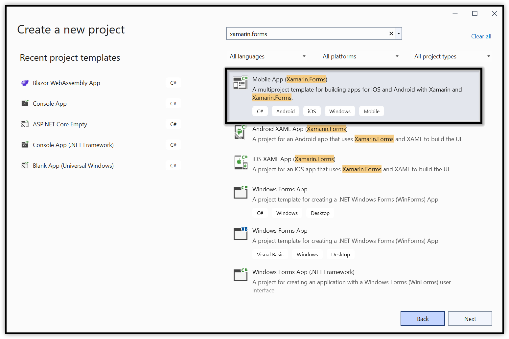
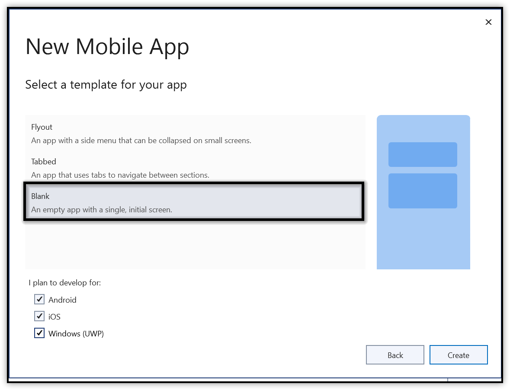
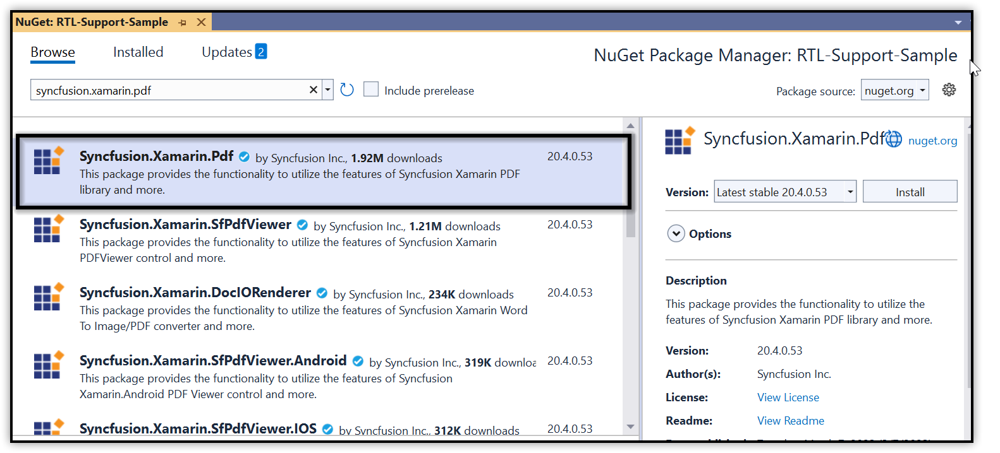
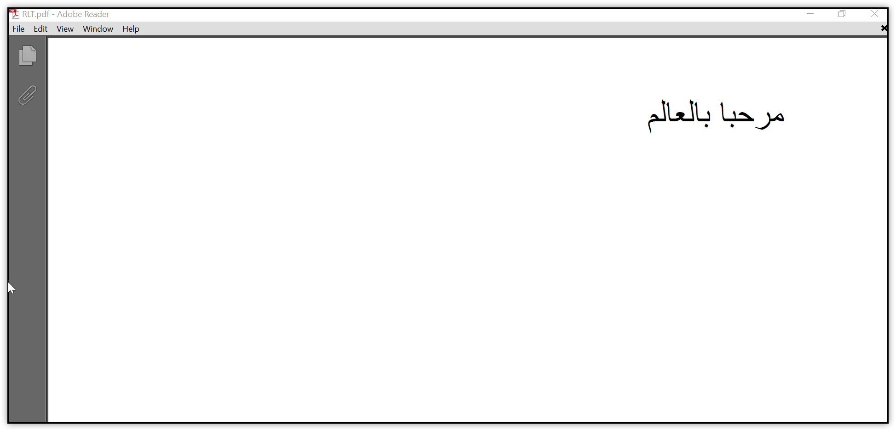

# Adding RTL support to PDF in Xamarin.

The [Syncfusion&reg; Essential&reg; PDF](https://www.syncfusion.com/document-processing/pdf-framework/net) is a .NET PDF library  from the Essential Studio&reg; can be used to draw right-to-left (RTL) and bi-directional (Bidi) text in a PDF document.

Name | Description
--- | ---
[RTL Support](https://github.com/SyncfusionExamples/Draw-RTL-text-in-PDF/tree/master/RTLSupport) | The Essential Studio&reg; can be used to draw right-to-left (RTL) and bi-directional (Bidi) text in a PDF document.

## What is right-to-left support?

In a right-to-left script, writing starts from the right side of the PDF page and continues to the left. The most commonly used RTL scripts are Arabic, Hebrew, Persian, and Urdu. 

                     مرحبا بالعالم      

## What is bi-directional support?  

Bi-directional text contains both right-to-left and left-to-right formats. For instance, a line may contain both Arabic and English texts. As you might imagine, there are several possibilities when dealing with Bidi text. Arabic text is written from right-to-left, but numbers are generally written left-to-right.

                   هناك 10 تفاحات 

## Adding RTL support to your PDF

While this post deals with the overall understanding of right-to-left, left-to-right, and bi-directional text, a little bit of code can help to understand how things works in the PDF.

1.Create a cross-platform app in Xamarin.Forms.



2.Select the Blank App template and the .NET Standard option under Code Sharing Strategy. 



3.Add the [Syncfusion.Xamarin.PDF](https://www.nuget.org/packages/Syncfusion.Xamarin.Pdf/) NuGet packages as a reference to the .Net Standard project in your Xamarin application.



4.Since the PDF standard font does not support Unicode character, you will need to add the TrueType font file to the assets folder in the .NET Standard project. Right click the font, select properties, and set its build action as embedded resource.

5.Add a button in the MainPage.xaml file.

```csharp

<?xml version="1.0" encoding="utf-8"?>
<ContentPage font-weight: bold;">//xamarin.com/schemas/2014/forms"
             >:x="http://schemas.microsoft.com/winfx/2009/xaml"
             >:local="clr-namespace:RTLSample"
             x:Class="RTLSample.MainPage">

    <StackLayout Padding="10">
        <Label x:Name="Content_heading" Text="Right-to-left text in PDF" FontSize="Large" FontAttributes="Bold" HorizontalOptions="Center" VerticalOptions="Center"></Label>
        <Label x:Name="Content_1" Text="This sample demonstrates how to add RTL text in the PDF document." FontSize="Medium" VerticalOptions="Center"></Label>
        <Button x:Name="btnGenerate" Text="Generate PDF" HorizontalOptions="Center" VerticalOptions="Center"></Button>
    </StackLayout>

</ContentPage>
```

6.Add the following code with the onButtonClicked method in the MainPage.xaml.cs file.

```csharp
//Create a new PDF document.
PdfDocument document = new PdfDocument();
//Add a new PDF page.
PdfPage page = document.Pages.Add();
//Load font.
Stream fontStream = typeof(App).GetTypeInfo().Assembly.GetManifestResourceStream("RTLDemo.Assets.arial.ttf");

//Create PDF TrueType font.
PdfFont pdfFont = new PdfTrueTypeFont(fontStream, 12);
//String format 
PdfStringFormat format = new PdfStringFormat();
//Set the format as right to left.
format.TextDirection = PdfTextDirection.RightToLeft;

//Set the alignment.
format.Alignment = PdfTextAlignment.Right;
SizeF pageSize = page.GetClientSize();
page.Graphics.DrawString("مرحبا بالعالم!", pdfFont, PdfBrushes.Black, new Syncfusion.Drawing.RectangleF(0, 0, pageSize.Width, pageSize.Height), format);

MemoryStream ms = new MemoryStream();
//Save the document.
document.Save(ms);
//Close the document 
document.Close(true);
ms.Position = 0;
if (Device.OS == TargetPlatform.WinPhone || Device.OS == TargetPlatform.Windows)
    Xamarin.Forms.DependencyService.Get<ISaveWindowsPhone>().Save("RTLText.pdf", "application/pdf", ms);
else
    Xamarin.Forms.DependencyService.Get<ISave>().Save("RTLText.pdf", "application/pdf", ms);
```

The following screenshot shows the output of the RTL support.



# How to run the examples
* Download this project to a location in your disk. 
* Open the solution file using Visual Studio. 
* Rebuild the solution to install the required NuGet package. 
* Run the application.

# Resources
*   **Product page:** [Syncfusion&reg; PDF Framework](https://www.syncfusion.com/document-processing/pdf-framework/net)
*   **Documentation page:** [Syncfusion&reg; .NET PDF library](https://help.syncfusion.com/file-formats/pdf/overview)
*   **Online demo:** [Syncfusion&reg; .NET PDF library - Online demos](https://ej2.syncfusion.com/aspnetcore/PDF/CompressExistingPDF#/bootstrap5)
*   **Blog:** [Syncfusion&reg; .NET PDF library - Blog](https://www.syncfusion.com/blogs/category/pdf)
*   **Knowledge Base:** [Syncfusion&reg; .NET PDF library - Knowledge Base](https://www.syncfusion.com/kb/windowsforms/pdf)
*   **EBooks:** [Syncfusion&reg; .NET PDF library - EBooks](https://www.syncfusion.com/succinctly-free-ebooks)
*   **FAQ:** [Syncfusion&reg; .NET PDF library - FAQ](https://www.syncfusion.com/faq/)

# Support and feedback
*   For any other queries, reach our [Syncfusion&reg; support team](https://www.syncfusion.com/support/directtrac/incidents/newincident?utm_source=github&utm_medium=listing&utm_campaign=github-docio-examples) or post the queries through the [community forums](https://www.syncfusion.com/forums?utm_source=github&utm_medium=listing&utm_campaign=github-docio-examples).
*   Request new feature through [Syncfusion&reg; feedback portal](https://www.syncfusion.com/feedback?utm_source=github&utm_medium=listing&utm_campaign=github-docio-examples).

# License
This is a commercial product and requires a paid license for possession or use. Syncfusion’s licensed software, including this component, is subject to the terms and conditions of [Syncfusion's EULA](https://www.syncfusion.com/eula/es/?utm_source=github&utm_medium=listing&utm_campaign=github-docio-examples). You can purchase a licnense [here](https://www.syncfusion.com/sales/products?utm_source=github&utm_medium=listing&utm_campaign=github-docio-examples) or start a free 30-day trial [here](https://www.syncfusion.com/account/manage-trials/start-trials?utm_source=github&utm_medium=listing&utm_campaign=github-docio-examples).

# About Syncfusion
Founded in 2001 and headquartered in Research Triangle Park, N.C., Syncfusion&reg; has more than 26,000+ customers and more than 1 million users, including large financial institutions, Fortune 500 companies, and global IT consultancies.

Today, we provide 1600+ components and frameworks for web ([Blazor](https://www.syncfusion.com/blazor-components?utm_source=github&utm_medium=listing&utm_campaign=github-docio-examples), [ASP.NET Core](https://www.syncfusion.com/aspnet-core-ui-controls?utm_source=github&utm_medium=listing&utm_campaign=github-docio-examples), [ASP.NET MVC](https://www.syncfusion.com/aspnet-mvc-ui-controls?utm_source=github&utm_medium=listing&utm_campaign=github-docio-examples), [ASP.NET WebForms](https://www.syncfusion.com/jquery/aspnet-webforms-ui-controls?utm_source=github&utm_medium=listing&utm_campaign=github-docio-examples), [JavaScript](https://www.syncfusion.com/javascript-ui-controls?utm_source=github&utm_medium=listing&utm_campaign=github-docio-examples), [Angular](https://www.syncfusion.com/angular-ui-components?utm_source=github&utm_medium=listing&utm_campaign=github-docio-examples), [React](https://www.syncfusion.com/react-ui-components?utm_source=github&utm_medium=listing&utm_campaign=github-docio-examples), [Vue](https://www.syncfusion.com/vue-ui-components?utm_source=github&utm_medium=listing&utm_campaign=github-docio-examples), and [Flutter](https://www.syncfusion.com/flutter-widgets?utm_source=github&utm_medium=listing&utm_campaign=github-docio-examples)), mobile ([Xamarin](https://www.syncfusion.com/xamarin-ui-controls?utm_source=github&utm_medium=listing&utm_campaign=github-docio-examples), [Flutter](https://www.syncfusion.com/flutter-widgets?utm_source=github&utm_medium=listing&utm_campaign=github-docio-examples), [UWP](https://www.syncfusion.com/uwp-ui-controls?utm_source=github&utm_medium=listing&utm_campaign=github-docio-examples), and [JavaScript](https://www.syncfusion.com/javascript-ui-controls?utm_source=github&utm_medium=listing&utm_campaign=github-docio-examples)), and desktop development ([WinForms](https://www.syncfusion.com/winforms-ui-controls?utm_source=github&utm_medium=listing&utm_campaign=github-docio-examples), [WPF](https://www.syncfusion.com/wpf-ui-controls?utm_source=github&utm_medium=listing&utm_campaign=github-docio-examples), [WinUI(Preview)](https://www.syncfusion.com/winui-controls?utm_source=github&utm_medium=listing&utm_campaign=github-docio-examples), [Flutter](https://www.syncfusion.com/flutter-widgets?utm_source=github&utm_medium=listing&utm_campaign=github-docio-examples) and [UWP](https://www.syncfusion.com/uwp-ui-controls?utm_source=github&utm_medium=listing&utm_campaign=github-docio-examples)). We provide ready-to-deploy enterprise software for dashboards, reports, data integration, and big data processing. Many customers have saved millions in licensing fees by deploying our software.
